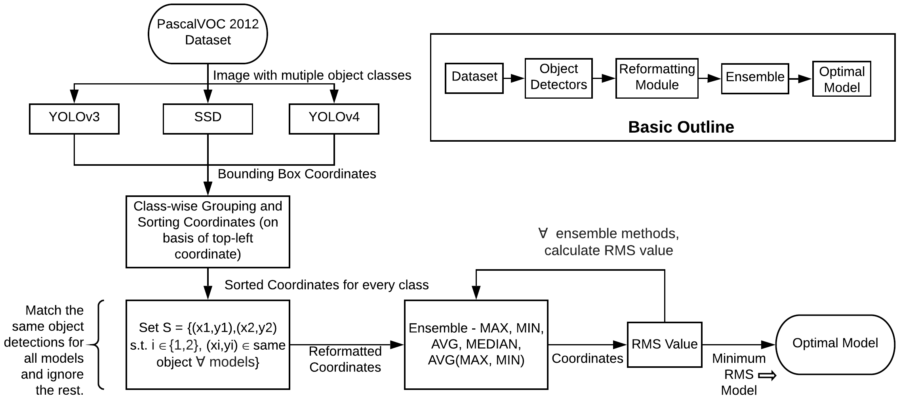
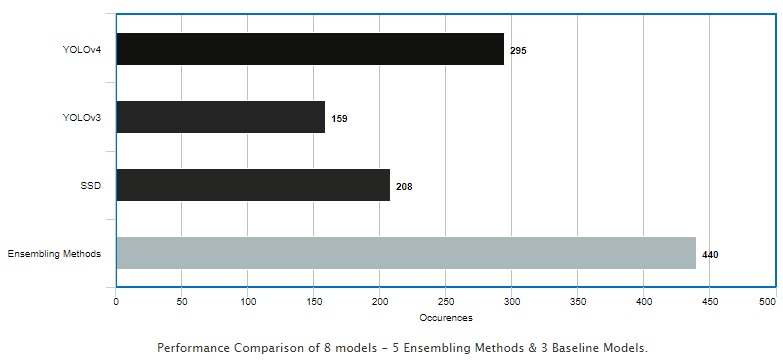
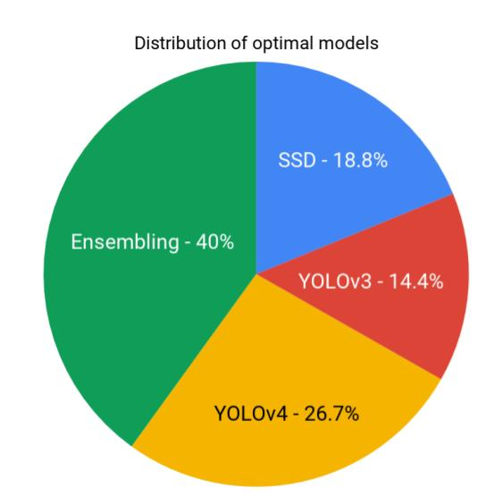
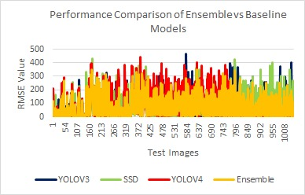
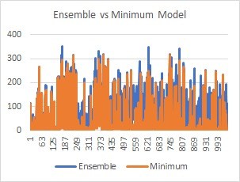

## Multi-Target Detection using Fusion Ensemble Methods
Object detection is an important computer vision problem with a multitude of applications. Researchers spend a good amount of time trying to choose an appropriate model for their dataset. This project aims to automate model selection for object detection using ensemble methods. The focus is on a novel idea of **improving the accuracy of the detectors keeping the speed constant for the real-time systems**. We propose a **fusion ensemble method** which uses **root mean square metric** to improve object detection accuracy in a real-time scenario, which the existing baseline models fail to achieve, implying that there is a scope of improvement in the baseline models.

### Work Flow 

### Installation Steps 
Environment : Ubuntu 18.04 LTS  
Dataset : PASCALVOC 2012(Install it from the http://host.robots.ox.ac.uk/pascal/VOC/  
1.) Install and set up YOLOv3, YOLOv4 and SSD models from their respective official implementations.  
2.) Go in the CombiningFormat.py and EnsembleMethod.py and make changes to the respective paths you wish to store your results in.  
3.) On Terminal run : ./run_system.sh  
If the bash file has any issues with the permission access, do chmod +x run_system.sh and then execute the file.  
4.) Results will be stored in the ${pwd}/output directory with the text file(pred.txt) including all RMS values.  

### Results 
  
  
Results have been obtained for 1102 images of PASCAL-VOC 2012 datase. 
The figure above shows that **ensembling methods** cumulatively outperforms all the individual models taken into consideration. The ensembling methods, collectively constitutes for **around 40%** of the cases, implying that the individual models fail for at least 40% or more, or in other words, there is a chance of obtaining more accurate detections - i.e. for individual models, **YOLOv4 has 73.3%, YOLOv3 - 85.65% and SSD - 81.25% cases where they fail to detect the objects accurately** and there is a scope of improvement if the advantages of all the models are aggregated. 

From the above obtained results, it is evident that no one particular baseline method - YOLOv3, YOLOv4, SSD individually performs optimal detection for the majority of cases. This necessitates the need for an ensembling technique. The ensemble methods capture the advantages of each of these baselines models and combines them together statistically in order to obtain a more accurate detection results. One can interpret each of the ensembling methods conceptually. MAX can be seen as expanding the bounding box, MIN shrinks the box. AVG(MIN,MAX) is a mid-point method that acts as a trade-off between MIN and MAX, giving a more nuanced result. 

  
The figure illustrates the plot of RMS value vs the test images for every model taken into consideration. From the figure, we can witness that **ensembling has the least RMS line graph** indicating that ensembling resulted in the least RMS value amongst all in most of the cases. Furthermore, analysing the graph, as shown in   
  
, we can see that **optimal model for most of the images coincides with the ensemble model, proving the need for ensemble for more accurate detections**.
  
##### In case of any doubts, please feel free to reach out to us at : btpnitt@gmail.com
